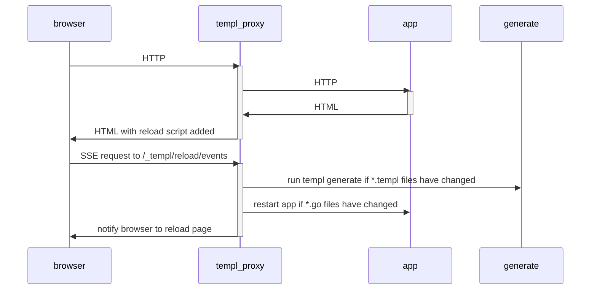
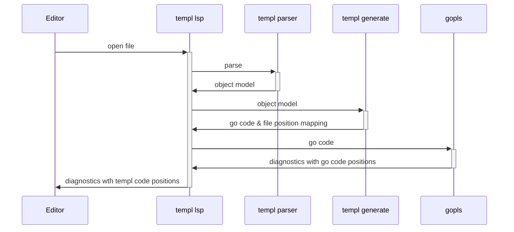
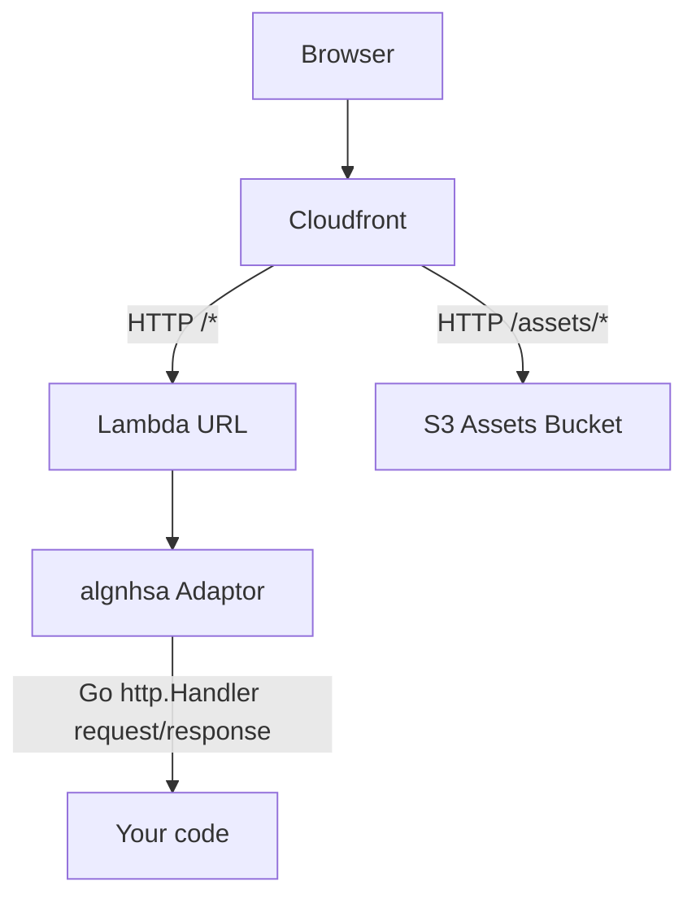

# templ intro

## https://templ.guide
## https://github.com/a-h/templ
## @adrianhesketh

---
layout: section
---

# Use an SPA when you care about the user experience

---

# The user experience


---
layout: section
---

# Well, at least the developer experience is good

---

# The developer experience


---
layout: two-cols-header
---

# Using React

::left::

- Linting rules
- TypeScript
- Bundlers / transpilers
- Isomorphic rendering
- Test frameworks
- State management
- Language complexity
- Performance

::right::


---
layout: section
---

# Thought experiment...

---
layout: section
---

# Would using an SSR-only approach actually be worse?

---

# SSR

* Needed anyway for SEO
* Required for accessibility
* Can be in a faster language
* Can use new techniques like HTMX and Hotwire
* Can use Websockets and Server Sent Events
* No big JavaScript bundles
  - https://tonsky.me/blog/js-bloat/

---

# What do we need?

- Generate HTML on the server
- Match developer experience of React
- Component libraries

---

# Go stdlib templates

```html
<div>
    {{ .Count }} items are made of 
    {{ .Material | toUpper }} 
    and cost {{ .Price }}
</div>
```

```go
type Inventory struct {
	Material string
	Count    uint
}

//go:embed templates/example.gohtml
var exampleTemplateText string
var tmpl = template.Must(template.New("example").Parse(exampleTemplateText))

func main() {
	http.HandleFunc("/", func(w http.ResponseWriter, r *http.Request) {
		err := tmpl.Execute(w, Inventory{"paper", 100})
		if err != nil {
			http.Error(w, fmt.Sprintf("failed to execute template: %v", err), http.StatusInternalServerError)
		}
	})
	http.ListenAndServe(":7777", nil)
}
```

---

# Fails on program startup

```html {3}
<div>
    {{ .Count }} items are made of 
    {{ .Material | toUpper }} 
    and cost {{ .Price }}
</div>
```

```go {8}
type Inventory struct {
	Material string
	Count    uint
}

//go:embed templates/example.gohtml
var exampleTemplateText string
var tmpl = template.Must(template.New("example").Parse(exampleTemplateText))

func main() {
	http.HandleFunc("/", func(w http.ResponseWriter, r *http.Request) {
		err := tmpl.Execute(w, Inventory{"paper", 100})
		if err != nil {
			http.Error(w, fmt.Sprintf("failed to execute template: %v", err), http.StatusInternalServerError)
		}
	})
	http.ListenAndServe(":7777", nil)
}
```

---

# Fails when the handler is hit

```html {4}
<div>
    {{ .Count }} items are made of 
    {{ .Material | toUpper }} 
    and cost {{ .Price }}
</div>
```

```go {12-15}
type Inventory struct {
	Material string
	Count    uint
}

//go:embed templates/example.gohtml
var exampleTemplateText string
var tmpl = template.Must(template.New("example").Parse(exampleTemplateText))

func main() {
	http.HandleFunc("/", func(w http.ResponseWriter, r *http.Request) {
		err := tmpl.Execute(w, Inventory{"paper", 100})
		if err != nil {
			http.Error(w, fmt.Sprintf("failed to execute template: %v", err), http.StatusInternalServerError)
		}
	})
	http.ListenAndServe(":7777", nil)
}
```

---

# No syntax highlighting or intellisense


---
layout: section
---

# Worse than options in other languages

---

# Razor pages

* Introduced in 2011 - over 10 years ago
* Shipped with autocomplete and syntax highlighting
* Compiled into MSIL, then JIT compiled into machine code

```cs
public class AboutModel : PageModel
{
    public string TimeOfDay { get; set; }
    public void OnGet()
    {
        TimeOfDay = "evening";
        if(DateTime.Now.Hour < 18){
            TimeOfDay = "afternoon";
        }
        if(DateTime.Now.Hour < 12){
            TimeOfDay = "morning";
        }
    }
}
```

```razor
@page
@model Bakery.Pages.AboutModel
<section id="main">
    <h1>Good @Model.TimeOfDay, and welcome to The Bakery Shop!</h1>
</section>
```

---

# JSX

* Introduced in 2013 - 8 years ago
* Autocomplete introduced in 2017 with TypeScript 2.3
* Transpiled into JavaScript, then ran in Node or a browser

```jsx
function Welcome(props) {
  return <h1>Hello, {props.name}</h1>;
}
```

* Can get type safety with TypeScript.

```tsx
type WelcomeProps = { name: string };

const Welcome: React.FC<WelcomeProps> = (props) => (
  <h1>Hello, {props.name}</h1>
);
```

---

# templ

* Started in 2021
* Autocomplete included from the start
* Originally trying to implement IDE features for Quicktemplate - https://github.com/valyala/quicktemplate/issues/80
* Compiled into Go code, then compiled into machine code

```go {|3|4|3-5,9|11-13|16-20|17|18|19}
package main

templ Hello(name string) {
  <div>Hello, { name }</div>
}

templ Greeting(person Person) {
  <div class="greeting">
    @Hello(person.Name)
  </div>
  if person.Age == 42 {
    <div>Knows the meaning of life, the universe, and everything</div>
  }
}

func main() {
  p := Person{Name: "Arthur Dent", Age: 42}
  c := Greeting(p)
  c.Render(context.Background(), os.Stdout)
}
```

---

# Workflow

<v-clicks>

### Install templ

`go install github.com/a-h/templ/cmd/templ@latest`

### Create Go project

`go mod init example`

### Create a templ file

`example.templ`

### Generate Go code from the template

`templ generate`

### Run

`go run .`

</v-clicks>


---

# templ CLI

```sh
templ generate
```

```
(✓) Complete [ updates=1 duration=2.795834ms ]
```

---

# Generated `example_templ.go` file

```go
func Hello(name string) templ.Component {
	return templ.ComponentFunc(func(ctx context.Context, w io.Writer) (err error) {
		// ...
		_, err = templBuffer.WriteString("<div>")
		// ...
		var_2 := `Hello, `
		_, err = templBuffer.WriteString(var_2)
		// ...
		var var_3 string = name
		_, err = templBuffer.WriteString(templ.EscapeString(var_3))
		// ...
		_, err = templBuffer.WriteString("</div>")
		// ...
		return err
	})
}
```

---

# Compile errors

```
go build
# github.com/a-h/examplelsp/templtemplates
./example_templ.go:67:22: person.LastName undefined (type Person has no field or method LastName)
```

---

# Hot reload

```bash
templ generate --watch --proxy=http://localhost:7777 --cmd='go run .'
```


---

# Hot reload process



---

# templ VS Code Extension &amp; LSP


---

# Editor plugins

* VS Code
* Vim / Neovim
* Goland


---

# templ LSP uses gopls



---
layout: section
---

# templ.Component

---

# templ.Component

```go
package templ

type Component interface {
	Render(ctx context.Context, w io.Writer) error
}
```

---

# templ component

* Contains HTML, branching logic, and other components
* Compiled into a function called `Hello` that returns a `templ.Component`
* Content is automatically HTML encoded

```go
templ Hello(id, name string) {
  <div id={ id }>Hello, { name }</div>
}
```

---

# Code component

```go {|11-13|15-18|20-23}
package main

import (
	"context"
	"io"
	"os"

	"github.com/a-h/templ"
)

type Button struct {
	Text string
}

func (b Button) Render(ctx context.Context, w io.Writer) error {
	_, err := io.WriteString(w, "<button>"+b.Text+"</button>")
	return err
}

func main() {
	btn := Button{Text: "Click me"}
	btn.Render(context.Background(), os.Stdout)
}
```

---

# Code component

```go
package main

import (
	"context"
	"io"
	"os"

	"github.com/a-h/templ"
)

func button(text string) templ.Component {
	return templ.ComponentFunc(func(ctx context.Context, w io.Writer) error {
		_, err := io.WriteString(w, "<button>"+text+"</button>")
		return err
	})
}

func main() {
	btn := button("Click me")
	btn.Render(context.Background(), os.Stdout)
}
```

---

# Template composition

```go
templ showAll() {
	@left()
	@middle()
	@right()
}

templ left() {
	<div>Left</div>
}

templ middle() {
	<div>Middle</div>
}

templ right() {
	<div>Right</div>
}

func main() {
  showAll().Render(context.Background(), os.Stdout)
}
```

---

# Writing to files

```go
func writeToFile(c templ.Component, filename string) error {
  f, err := os.Create(filename)
  if err != nil {
    return err
  }
  defer f.Close()

  // Because f implements io.Writer, we can use it here.
  return c.Render(context.Background(), f)
}
```

---

# Using in a HTTP server

## `components.templ`

```go
package main

templ hello() {
	<div>Hello</div>
}
```

## `main.go`

```go
func main() {
	http.Handle("/", templ.Handler(hello()))

	http.ListenAndServe(":8080", nil)
}
```

---

# Hosting static content alongside

## `components.templ`

```go
package main

templ hello() {
  <html>
    <head>
      <script src="/static/htmx.js" integrity="sha384-xxxxx" crossorigin="anonymous"></script>
    </head>
    <body>
      
    </body>
  </html>
}
```

## `main.go`

```go
func main() {
	http.Handle("/", templ.Handler(hello()))
	http.Handle("/static/", http.StripPrefix("/static/", http.FileServer(http.Dir("static")))

	http.ListenAndServe(":8080", nil)
}
```

---
layout: section
---

# Hosting

---

# Docker

```dockerfile {|1-7|9-17}
# Build.
FROM golang:1.22 AS build-stage
WORKDIR /app
COPY go.mod go.sum ./
RUN go mod download
COPY . /app
RUN CGO_ENABLED=0 GOOS=linux go build -o /entrypoint

# Deploy.
FROM gcr.io/distroless/static-debian12 AS release-stage
WORKDIR /
COPY --from=build-stage /entrypoint /entrypoint
COPY --from=build-stage /app/assets /assets
EXPOSE 8080
USER nonroot:nonroot
ENTRYPOINT ["/entrypoint"]
```

---

# Lambda

```go
package main

import "github.com/akrylysov/algnhsa"

func main() {
  h := templ.Handler(hello())
  algnhsa.ListenAndServe(h, nil)
}
```

---

# Static content with Lambda?



---
layout: section
---

# Integrations

---

# HTMX

- https://htmx.org/examples/
- https://templ.guide/server-side-rendering/htmx

---
layout: section
---

# React

---

# Create React components

```tsx
export const Hello = (name: string) => (
  <div>Hello {name} (Client-side React, rendering server-side data)</div>
);

export function renderHello(id: string, name: string) {
	const rootElement = document.getElementById(id);
	if (!rootElement) {
		throw new Error(`Could not find element with id ${id}`);
	}
	const reactRoot = createRoot(rootElement);
	reactRoot.render(Hello(name));
}
```

- https://templ.guide/syntax-and-usage/using-react-with-templ/

---

# Build with esbuild

```sh
esbuild --bundle index.ts --outdir=../static --minify --global-name=bundle
```

---

# Dynamically create HTML elements and call the function

```go
script renderHelloReact(id, name string) {
	// Use the renderHello function from the React bundle.
	bundle.renderHello(id, name)
}

templ Hello(id, name string) {
	<div id={ id }></div>
	@renderHelloReact(id, name)
}

templ page() {
  <html>
    <head>
       <script src="static/index.js"></script>
    </head>
    <body>
      @Hello("react-hello-john", "John")
      @Hello("react-hello-jane", "Jane")
    </body>
  </html>
}
```

---
layout: section
---

# Other Go templating libraries

---

# stdlib

```go
package testgotemplates

import "html/template"

var goTemplate = template.Must(template.New("example").Parse("<div>{{ . }}</div>"))

templ Example() {
	<!DOCTYPE html>
	<html>
		<body>
			@templ.FromGoHTML(goTemplate, "Hello, World!")
		</body>
	</html>
}
```

---

# gomponents

```go
package main

templ Page() {
	@toTempl(helloGomponent())
}
```

```go
package main

import (
	"github.com/a-h/templ"
	g "github.com/maragudk/gomponents"
	. "github.com/maragudk/gomponents/html"
)

func main() {
	Page().Render(context.Background(), os.Stdout)
}

func toTempl(n g.Node) templ.Component {
	return templ.ComponentFunc(func(ctx context.Context, w io.Writer) error {
		return n.Render(w)
	})
}

func helloGomponent() g.Node {
	return Div(g.Text("Hello, Gomponent!"))
}
```

---
layout: section
---

# What's next

---

# Improvements to CSS handling

```go
templ Hello(screenBG, printBG string) {
  <style type="text/css">
    body {
      background-color: {{ screenBG }};
    }
    @media print {
      body {
        background-color: {{ printBG }};
      }
    }
  </style>
}
```

---

# Improvements to script handling

```go
templ Hello(screenBG, printBG string) {
  <style type="text/css">
    body {
      background-color: {{ screenBG }};
    }
    @media print {
      body {
        background-color: {{ printBG }};
      }
    }
  </style>
}
```

---

# templ is faster


