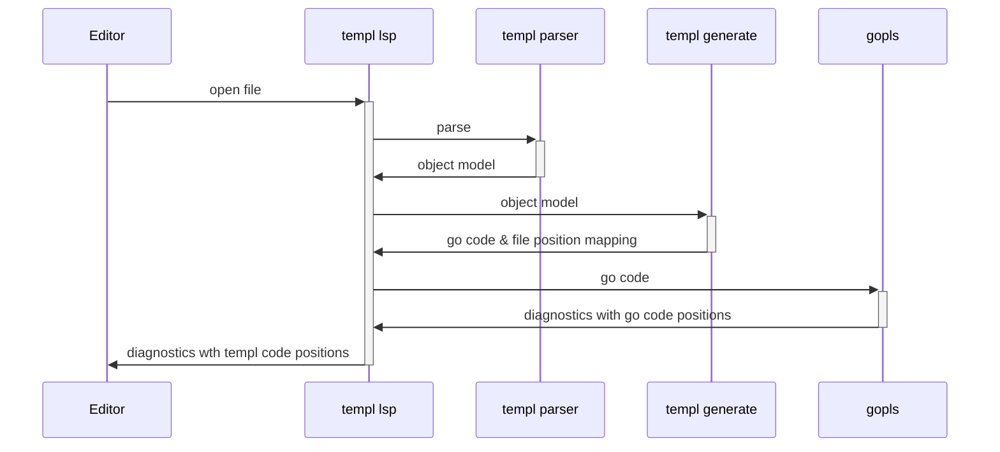
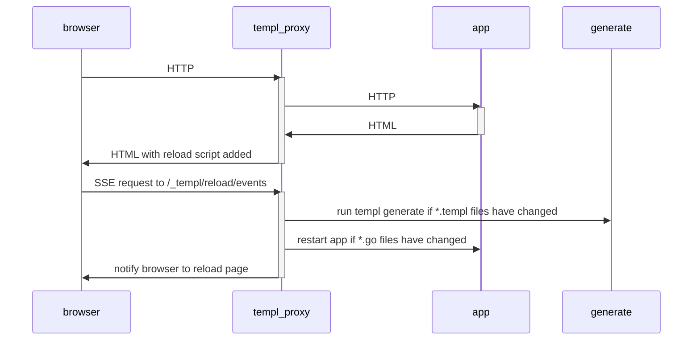
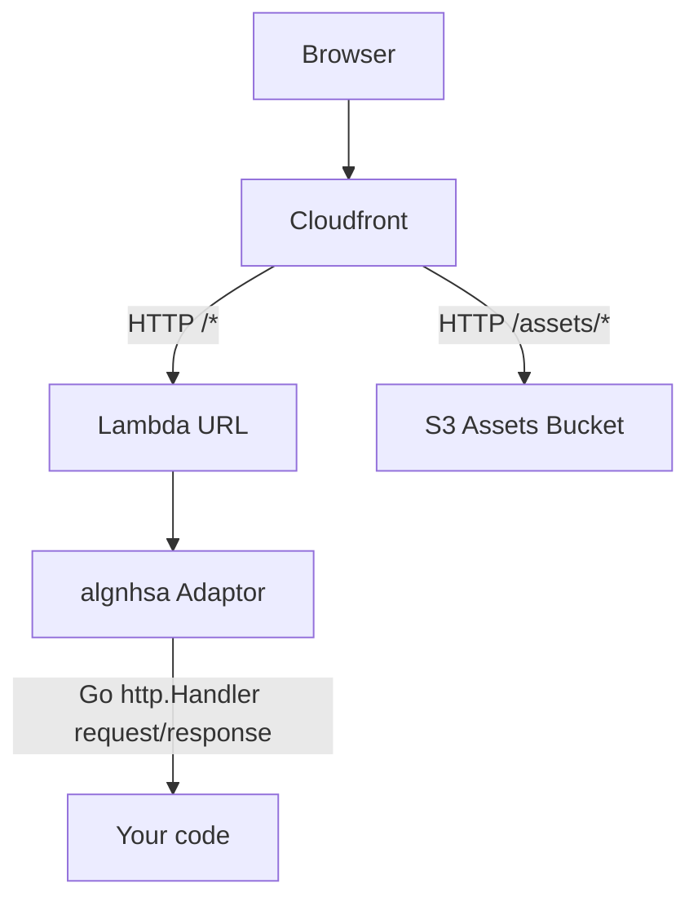

# templ intro

## https://templ.guide
## https://github.com/a-h/templ
## @adrianhesketh

---
layout: section
---

# Use an SPA when you care about the user experience

---

# The user experience


---
layout: section
---

# Well, at least the developer experience is good

---

# The developer experience


---
layout: two-cols-header
---

# Using React

::left::

- Linting rules
- TypeScript
- Bundlers / transpilers
- Isomorphic rendering
- Test frameworks
- State management
- Language complexity
- Performance

::right::


---
layout: section
---

# Thought experiment...

---
layout: section
---

# Would using an SSR-only approach actually be worse?

---

# SSR

* Needed for SEO
* Required for accessibility
* Have to wait for data from the Server anyway
* Can be in a faster language
* Can use new techniques like HTMX and Hotwire
* Can use Websockets and Server Sent Events
* No big JavaScript bundles
  - https://tonsky.me/blog/js-bloat/

---

# What do we need?

- Generate HTML on the server
- Match developer experience of React
- Component libraries

---

# Go stdlib templates

```html
<div>
    {{ .Count }} items are made of 
    {{ .Material | toUpper }} 
    and cost {{ .Price }}
</div>
```

```go
type Inventory struct {
	Material string
	Count    uint
}

//go:embed templates/example.gohtml
var exampleTemplateText string
var tmpl = template.Must(template.New("example").Parse(exampleTemplateText))

func main() {
	http.HandleFunc("/", func(w http.ResponseWriter, r *http.Request) {
		err := tmpl.Execute(w, Inventory{"paper", 100})
		if err != nil {
			http.Error(w, fmt.Sprintf("failed to execute template: %v", err), http.StatusInternalServerError)
		}
	})
	http.ListenAndServe(":7777", nil)
}
```

---

# Fails on program startup

```html {3}
<div>
    {{ .Count }} items are made of 
    {{ .Material | toUpper }} 
    and cost {{ .Price }}
</div>
```

```go {8}
type Inventory struct {
	Material string
	Count    uint
}

//go:embed templates/example.gohtml
var exampleTemplateText string
var tmpl = template.Must(template.New("example").Parse(exampleTemplateText))

func main() {
	http.HandleFunc("/", func(w http.ResponseWriter, r *http.Request) {
		err := tmpl.Execute(w, Inventory{"paper", 100})
		if err != nil {
			http.Error(w, fmt.Sprintf("failed to execute template: %v", err), http.StatusInternalServerError)
		}
	})
	http.ListenAndServe(":7777", nil)
}
```

---

# Fails when the handler is hit

```html {4}
<div>
    {{ .Count }} items are made of 
    {{ .Material | toUpper }} 
    and cost {{ .Price }}
</div>
```

```go {12-15}
type Inventory struct {
	Material string
	Count    uint
}

//go:embed templates/example.gohtml
var exampleTemplateText string
var tmpl = template.Must(template.New("example").Parse(exampleTemplateText))

func main() {
	http.HandleFunc("/", func(w http.ResponseWriter, r *http.Request) {
		err := tmpl.Execute(w, Inventory{"paper", 100})
		if err != nil {
			http.Error(w, fmt.Sprintf("failed to execute template: %v", err), http.StatusInternalServerError)
		}
	})
	http.ListenAndServe(":7777", nil)
}
```

---

# No syntax highlighting or intellisense


---
layout: section
---

# Worse than options in other languages

---

# Razor pages

* Introduced in 2011 - over 10 years ago
* Shipped with autocomplete and syntax highlighting
* Compiled into MSIL, then JIT compiled into machine code

```cs
public class AboutModel : PageModel
{
    public string TimeOfDay { get; set; }
    public void OnGet()
    {
        TimeOfDay = "evening";
        if(DateTime.Now.Hour < 18){
            TimeOfDay = "afternoon";
        }
        if(DateTime.Now.Hour < 12){
            TimeOfDay = "morning";
        }
    }
}
```

```razor
@page
@model Bakery.Pages.AboutModel
<section id="main">
    <h1>Good @Model.TimeOfDay, and welcome to The Bakery Shop!</h1>
</section>
```

---

# JSX

* Introduced in 2013 - 8 years ago
* Autocomplete introduced in 2017 with TypeScript 2.3
* Transpiled into JavaScript, then ran in Node or a browser

```jsx
function Welcome(props) {
  return <h1>Hello, {props.name}</h1>;
}
```

* Can get type safety with TypeScript.

```tsx
type WelcomeProps = { name: string };

const Welcome: React.FC<WelcomeProps> = (props) => (
  <h1>Hello, {props.name}</h1>
);
```

---

# templ

* Started in 2021
* Autocomplete included from the start
* Originally trying to implement IDE features for Quicktemplate - https://github.com/valyala/quicktemplate/issues/80
* Compiled into Go code, then compiled into machine code

```go {|3|4|3-5,9|11-13|16-20|17|18|19}
package main

templ Hello(name string) {
  <div>Hello, { name }</div>
}

templ Greeting(person Person) {
  <div class="greeting">
    @Hello(person.Name)
  </div>
  if person.Age == 42 {
    <div>Knows the meaning of life, the universe, and everything</div>
  }
}

func main() {
  p := Person{Name: "Arthur Dent", Age: 42}
  c := Greeting(p)
  c.Render(context.Background(), os.Stdout)
}
```

---

# Workflow

<v-clicks>

### Install templ

`go install github.com/a-h/templ/cmd/templ@latest`

### Create Go project

`go mod init example`

### Create a templ file

`example.templ`

### Generate Go code from the template

`templ generate`

### Run

`go run .`

</v-clicks>


---

# templ CLI

```sh
templ generate
```

```
(✓) Complete [ updates=1 duration=2.795834ms ]
```

---

# Generated `example_templ.go` file

```go
func Hello(name string) templ.Component {
	return templ.ComponentFunc(func(ctx context.Context, w io.Writer) (err error) {
		// ...
		_, err = templBuffer.WriteString("<div>")
		// ...
		var_2 := `Hello, `
		_, err = templBuffer.WriteString(var_2)
		// ...
		var var_3 string = name
		_, err = templBuffer.WriteString(templ.EscapeString(var_3))
		// ...
		_, err = templBuffer.WriteString("</div>")
		// ...
		return err
	})
}
```

---

# Compiled code is fast


---

# Compile errors

```
go build
# github.com/a-h/examplelsp/templtemplates
./example_templ.go:67:22: person.LastName undefined (type Person has no field or method LastName)
```

---

# templ VS Code Extension &amp; LSP


---

# Editor plugins

* VS Code
* Vim / Neovim
* Goland


---

# templ LSP uses gopls



---

# Live reload

```bash
templ generate --watch --proxy=http://localhost:7777 --cmd='go run .'
```


---

# Live reload process




---
layout: section
---

# templ.Component

---

# templ.Component

```go
package templ

type Component interface {
	Render(ctx context.Context, w io.Writer) error
}
```

---

# templ component

* Contains HTML, branching logic, and other components
* Compiled into a function called `Hello` that returns a `templ.Component`
* Content is automatically HTML encoded

```go
templ Hello(id, name string) {
  <div id={ id }>Hello, { name }</div>
}
```

---

# Code component

```go {|11-13|15-18|20-23}
package main

import (
	"context"
	"io"
	"os"

	"github.com/a-h/templ"
)

type Button struct {
	Text string
}

func (b Button) Render(ctx context.Context, w io.Writer) error {
	_, err := io.WriteString(w, "<button>"+b.Text+"</button>")
	return err
}

func main() {
	btn := Button{Text: "Click me"}
	btn.Render(context.Background(), os.Stdout)
}
```

---

# Code component

```go {|12-15}
package main

import (
	"context"
	"io"
	"os"

	"github.com/a-h/templ"
)

func button(text string) templ.Component {
	return templ.ComponentFunc(func(ctx context.Context, w io.Writer) error {
		_, err := io.WriteString(w, "<button>"+text+"</button>")
		return err
	})
}

func main() {
	btn := button("Click me")
	btn.Render(context.Background(), os.Stdout)
}
```

---

# Template composition

```go {|7-9|10-13|14-17|1-5}
templ showAll() {
	@left()
	@middle()
	@right()
}

templ left() {
	<div>Left</div>
}

templ middle() {
	<div>Middle</div>
}

templ right() {
	<div>Right</div>
}

func main() {
  showAll().Render(context.Background(), os.Stdout)
}
```

---

# Writing to files

```go {|2-6|8-9}
func writeToFile(c templ.Component, filename string) error {
  f, err := os.Create(filename)
  if err != nil {
    return err
  }
  defer f.Close()

  // Because f implements io.Writer, we can use it here.
  return c.Render(context.Background(), f)
}
```

---

# Using in a HTTP server

## `components.templ`

```go
package main

templ hello() {
	<div>Hello</div>
}
```

## `main.go`

```go
func main() {
	http.Handle("/", templ.Handler(hello()))

	http.ListenAndServe(":8080", nil)
}
```

---

# Hosting static content alongside

## `components.templ`

```go
package main

templ hello() {
  <html>
    <head>
      <script src="/static/htmx.js" integrity="sha384-xxxxx" crossorigin="anonymous"></script>
    </head>
    <body>
      
    </body>
  </html>
}
```

## `main.go`

```go
func main() {
	http.Handle("/", templ.Handler(hello()))
	http.Handle("/static/", http.StripPrefix("/static/", http.FileServer(http.Dir("static"))))

	http.ListenAndServe(":8080", nil)
}
```

---
layout: section
---

# Hosting

---

# Docker

```dockerfile {|1-7|9-17}
# Build.
FROM golang:1.22 AS build-stage
WORKDIR /app
COPY go.mod go.sum ./
RUN go mod download
COPY . /app
RUN CGO_ENABLED=0 GOOS=linux go build -o /entrypoint

# Deploy.
FROM gcr.io/distroless/static-debian12 AS release-stage
WORKDIR /
COPY --from=build-stage /entrypoint /entrypoint
COPY --from=build-stage /app/assets /assets
EXPOSE 8080
USER nonroot:nonroot
ENTRYPOINT ["/entrypoint"]
```

---

# Lambda

```go {|6|3,7}
package main

import "github.com/akrylysov/algnhsa"

func main() {
  h := templ.Handler(hello())
  algnhsa.ListenAndServe(h, nil)
}
```

---

# Static content with Lambda?



---
layout: section
---

# Integrations

---
layout: two-cols-header
---

# HTMX

::left::

- https://htmx.org/examples/
- https://templ.guide/server-side-rendering/htmx
- https://github.com/joerdav/shopping-list/
- SSE and websocket integration

::right::


---
layout: section
---

# List page

---

## `/routes/users/view.templ`

```go {|5-15|7-9|10-15|17-}
package users

import "github.com/a-h/templ-htmx/db"

templ View(users []db.User) {
	<h1>Users</h1>
	<ul>
		<li><a href="/users/add" hx-boost="true">Add user</a></li>
	</ul>
	if len(users) == 0 {
		<p>No users</p>
	} else {
		@Users(users)
	}
}

templ Users(users []db.User) {
	<table class="table">
		<tr>
			<th>Username</th>
			<th>Email</th>
		</tr>
		for _, user := range users {
			<tr>
				<td>{ user.UserName }</td>
				<td>{ user.Email }</td>
			</tr>
		}
	</table>
}
```

---

## `/routes/users/handler.go`

```go {|11-18|14|20-|21|27-28}
func NewHandler(db *db.DB) http.Handler {
	return &Handler{
		DB: db,
	}
}

type Handler struct {
	DB *db.DB
}

func (h *Handler) ServeHTTP(w http.ResponseWriter, r *http.Request) {
	switch r.Method {
	case http.MethodGet:
		h.Get(w, r)
	default:
		http.Error(w, "Method not allowed", http.StatusMethodNotAllowed)
	}
}

func (h *Handler) Get(w http.ResponseWriter, r *http.Request) {
	users, err := h.DB.List()
	if err != nil {
		http.Error(w, err.Error(), http.StatusInternalServerError)
		return
	}

	v := layout.Handler(View(users))
	v.ServeHTTP(w, r)
}
```

---
layout: section
---

# Add page

---

## `/routes/users/add/model.go`

```go {|1-6|8-14|16-18}
type Model struct {
	Initial   bool
	UserName  string
	Email     string
	Error     string
}

func (m *Model) ValidateUserName() (msgs []string) {
	if m.Initial { return }
	if m.UserName == "" {
		msgs = append(msgs, "Username is required")
	}
	return msgs
}

func (m *Model) UserNameHasError() bool {
	return len(m.ValidateUserName()) > 0
}

func (m *Model) ValidateEmail() (msgs []string) {
	if m.Initial { return }
	if m.Email == "" || !strings.Contains(m.Email, "@") {
		return append(msgs, "Email is required")
	}
	return msgs
}

func (m *Model) EmailHasError() bool {
	return len(m.ValidateEmail()) > 0
}
```

---

## `/routes/users/add/view.templ`

```go {|8,26|9-12|13-16|17-24|25}
package usersadd

templ View(m *Model) {
	<h1>Add User</h1>
	<ul>
		<li><a href="/users" hx-boost="true">Back to Users</a></li>
	</ul>
	<form id="form" action="/users/add" method="post" hx-boost="true">
		<div id="username-group" class={ "form-group", templ.KV("has-error", m.UserNameHasError()) }>
			<label for="username">Username</label>
			<input type="text" id="username" name="username" class="form-control" placeholder="Username" value={ m.UserName }/>
		</div>
		<div id="email-group" class={ "form-group", templ.KV("has-error", m.EmailHasError()) }>
			<label for="email">Email</label>
			<input type="email" id="email" name="email" class="form-control" placeholder="Email" value={ m.Email }/>
		</div>
		<div id="validation">
			if m.Error != "" {
				<p class="error">{ m.Error }</p>
			}
			if msgs := m.Validate(); len(msgs) > 0 {
				@ValidationMessages(msgs)
			}
		</div>
		<input type="submit" value="Add"/>
	</form>
}
```

---

## `/routes/users/add/handler.go`

```go {|5-14|16-25}
type Handler struct {
	DB *db.DB
}

func (h *Handler) ServeHTTP(w http.ResponseWriter, r *http.Request) {
	switch r.Method {
	case http.MethodGet:
		h.Get(w, r)
	case http.MethodPost:
		h.Post(w, r)
	default:
		http.Error(w, "Method not allowed", http.StatusMethodNotAllowed)
	}
}

func (h *Handler) Get(w http.ResponseWriter, r *http.Request) {
	h.DisplayForm(w, r, &Model{
		Initial: true,
	})
}

func (h *Handler) DisplayForm(w http.ResponseWriter, r *http.Request, m *Model) {
	layout.Handler(View(m)).ServeHTTP(w, r)
}
```

---

## `/routes/users/add/handler.go`

```go {|2-6|8-13|14-17|19-27|29}
func (h *Handler) Post(w http.ResponseWriter, r *http.Request) {
	err := r.ParseForm()
	if err != nil {
		http.Error(w, err.Error(), http.StatusBadRequest)
		return
	}

	m := &Model{}
	err = schema.NewDecoder().Decode(m, r.PostForm)
	if err != nil {
		http.Error(w, err.Error(), http.StatusBadRequest)
		return
	}
	if len(m.Validate()) > 0 {
		h.DisplayForm(w, r, m)
		return
	}

	user := db.User{
		UserName: m.UserName,
		Email:    m.Email,
	}
	if err = h.DB.Save(user); err != nil {
		m.Error = "Failed to save the user. Please try again."
		h.DisplayForm(w, r, m)
		return
	}

	http.Redirect(w, r, "/users", http.StatusSeeOther)
}
```

---
layout: section
---

# React

---

# Create React components

```tsx {|1-3|5-12}
import React from "react";

export const Hello = (name: string) => (<div>Hello {name} (Client-side React, rendering server-side data)</div>);

// Provide a helper for rendering hello.
export function renderHello(e: HTMLElement) {
	const name = e.getAttribute('data-name') ?? "";
	createRoot(e).render(Hello(name));
}
```

- https://templ.guide/syntax-and-usage/using-react-with-templ/

---

# Build with esbuild

```sh
esbuild --bundle index.ts --outdir=../static --minify --global-name=bundle
```

---

# Dynamically create HTML elements and call the function

```go {|1-7|2,6|3-5|15-16}
templ Hello(name string) {
	<div data-name={ name }>
		<script type="text/javascript">
			bundle.renderHello(document.currentScript.closest('div'));
		</script>
	</div>
}

templ page() {
  <html>
    <head>
       <script src="static/index.js"></script>
    </head>
    <body>
      @Hello("John")
      @Hello("Jane")
    </body>
  </html>
}
```

---
layout: section
---

# Other Go templating libraries

---

# stdlib

```go {|5|11}
package testgotemplates

import "html/template"

var goTemplate = template.Must(template.New("example").Parse("<div>{{ . }}</div>"))

templ Example() {
	<!DOCTYPE html>
	<html>
		<body>
			@templ.FromGoHTML(goTemplate, "Hello, World!")
		</body>
	</html>
}
```

---

# gomponents

```go {|23-25|17-21|3-5|13-16}
package main

templ Page() {
	@toTempl(helloGomponent())
}

import (
	"github.com/a-h/templ"
	g "github.com/maragudk/gomponents"
	. "github.com/maragudk/gomponents/html"
)

func main() {
	Page().Render(context.Background(), os.Stdout)
}

func toTempl(n g.Node) templ.Component {
	return templ.ComponentFunc(func(ctx context.Context, w io.Writer) error {
		return n.Render(w)
	})
}

func helloGomponent() g.Node {
	return Div(g.Text("Hello, Gomponent!"))
}
```

---
layout: section
---

# Component libraries

---

# Create a component library

<v-clicks>

&bullet; Create a Git repo - `git init`

&bullet; Create a new Go module - `go mod init github.com/a-h/hellotempl`

&bullet; Import templ - `go get github.com/a-h/templ`

&bullet; Write a component (code, or templ), make sure the name starts with a capital letter.

```go
package hellotempl

templ Hello(name string) {
  <div>Hello, { name }!</div>
}
```

&bullet; Generate - `templ generate`

&bullet; Commit - `git add --all && git commit -m "first commit"`

&bullet; Push - `gh repo create github.com/a-h/hellotempl`

</v-clicks>

---

# Use your new component library

<v-clicks>

&bullet; Get it - `go get github.com/a-h/hellotempl`

</v-clicks>

<v-clicks>

```go {3|5-7}
package main

import "github.com/a-h/hellotempl"

templ Page() {
  @hellotempl.Hello("world")
}
```

</v-clicks>

---
# Use a ready-made library

* gopress.io
* https://github.com/indaco/goaster


---
layout: section
---

# Recently added

---

# Render once

```go {|3|6,12|7-11}
package once

var helloHandle = templ.NewOnceHandle()

templ hello(label, name string) {
  @helloHandle.Once() {
    <script type="text/javascript">
      function hello(name) {
        alert('Hello, ' + name + '!');
      }
    </script>
  }
  <input type="button" value={ label } data-name={ name } onclick="hello(this.getAttribute('data-name'))"/>
}

templ page() {
  @hello("Hello User", "user")
  @hello("Hello World", "world")
}
```

```html title="Output"
<script type="text/javascript">
  function hello(name) {
    alert('Hello, ' + name + '!');
  }
</script>
<input type="button" value="Hello User" data-name="user" onclick="hello(this.getAttribute('data-name'))">
<input type="button" value="Hello World" data-name="world" onclick="hello(this.getAttribute('data-name'))">
```

---
layout: section
---

# In the works...

---

# Automatic Go imports

```go
package main

templ Component() {
  { fmt.Sprintf("%d", 123) }
}
```
---

# Automatic Go imports

```go
package main

// Automatic insert of this.
import "fmt"

templ Component() {
  { fmt.Sprintf("%d", 123) }
}
```

---

# HTML LSP


---

# Streaming reponses

```go {|9-13|10-12}
templ Page(data chan string) {
	<!DOCTYPE html>
	<html>
		<head>
			<title>Page</title>
		</head>
		<body>
			<h1>Page</h1>
			for d := range data {
				@Flush() {
					<div>{ d }</div>
				}
			}
		</body>
	</html>
}
```

---
layout: section
---

# Project health

---
layout: two-cols-header
---

# Stats

::left::

* Maintained by me and @joerdav.
* &gt;100 contributors
* 6.2k stars
* 2k projects using it

::right::


---
layout: two-cols-header
---

# Online community

::left::

* Docs at https://templ.guide
* Gopher's Slack
* Github discussions
* YouTube
* Reddit

::right::


---
layout: section
---

# Questions?
